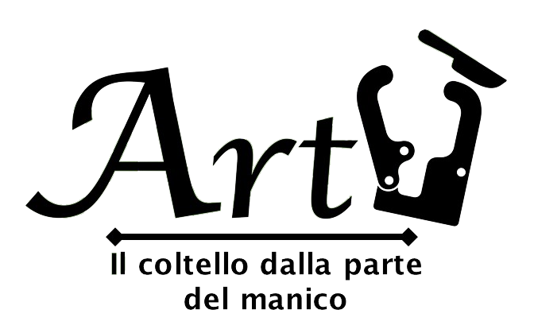
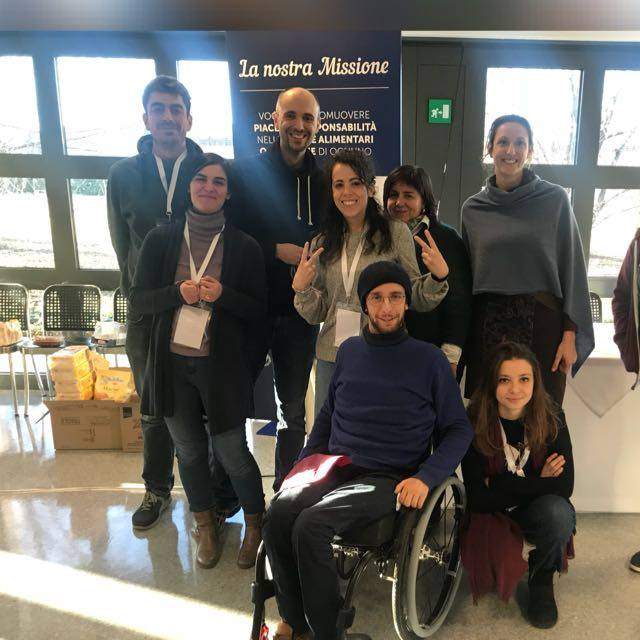
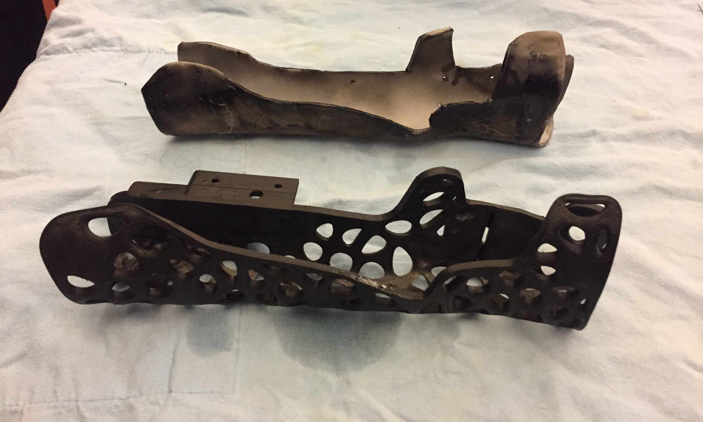
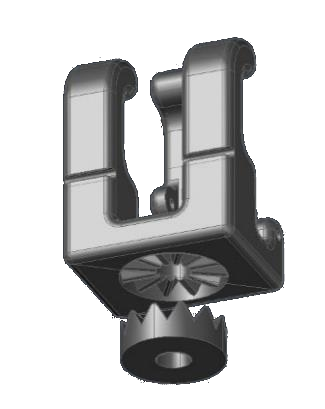
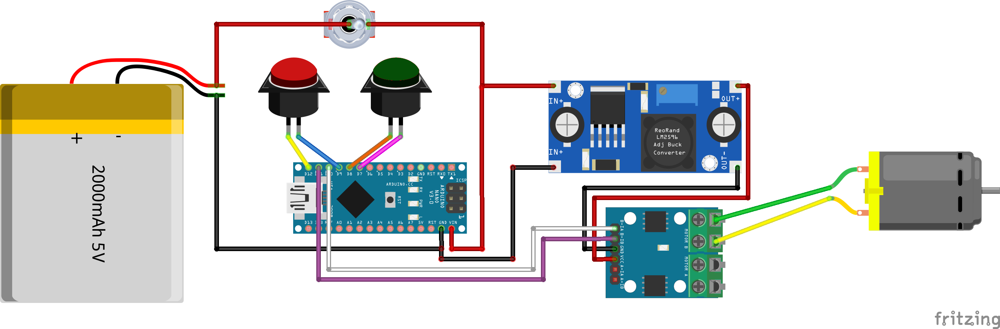
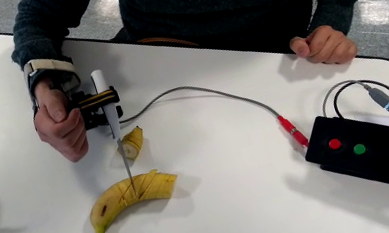

# Artu
## Hackability Barilla 2017

## What
Artù is a robotic exoskeleton designed for quadriplegic people that have limited movements in general and, therefore, many difficulties in the kitchen while cooking or eating. Artu helps these patients to hold and to use objects for cutting (all the knives) and hot cups, kettles and similar containers.

## Who (aka "Team Entusiasmo")

* Pietro Gemma
* Enrico Bassi
* Cristiana Giordano
* Emanuele Goldoni
* Luisa Carnevale Baraglia
* Nadia Crivelli
* Giuseppa Cafueri

## Why / When / Where

Artu was born around the needs of Pietro, our friend who lost the use of arms and legs due to an accident.

The whole team created Artù during [Hackability@Barilla](http://www.hackability.it/hackabilitybarilla/). The development took about one month, from January 20, 2018 to February 23, 2018.

The original idea was conceived at the Barilla Headquarters, Parma; the actual design, development and testing was carried out in Mantova (LTO Mantova) and Milano (Opendot).

## How

### BOM - Bill of Materials

* 1x DC 12V reversible high-torque worm gear box reduction electric motor
* 2x big push-buttons for controlling the movement
* 1x switch for turning on-off the system
* 1x 2600lithium-battery bank which powers all the system 
* 1x Arduino Nano
* 1x L9110S-based H-bridge motor driver controller 
* 1x XL6009-based DC DC step-up
* a bunch of screws, cables and connectors
* tens of meters of PLA filament

### The exoskeleton

Artu has a lightweight exoskeleton molded specifically on the shape of Pietro's forearm.
The first prototype was made with modeling paste and foam core. A second prototype was made of polyethylene, again molded on the shape of Pietro's forearm.
Then, we designed a flattened version of exoskeleton in CAD and we made it lightweight using a honeycomb-like structure. The exoskeleton can be easily and quickly printed in 3D and hot bended around the arm.

The exoskeleton has a movable plier to hold the objects and which can be rotated at different angles.
The bottom part of the plier is provided a straight bevel gear. This gear is coupled with a similar parallel gear near the palm of the exoskeleton. The gears have 12 teeth, so 12 possible rotating positions (30 degrees each) are allowed. In each of these positions, the two gears fit perfectly and are in a minimum-energy position. Using a thin steel thread, we can pull the plier towards the palm, keeping them locked in the desired position.

### The motorized plier

The exoskeleton mounts a DC 12V reversible high-torque electric motor. We used a 5rpm motor - honestly, its quite precise but slow (faster configurations are available as well). 

The motor is connected to a motor driver controller - the driver is powered by a step up, which increases the 5V voltage of the power bank USB output to 12V. The driver is also controlled by two pins of the Arduino Nano board. This board, which is too powered by the power bank, is also connected to the two push-buttons. The input pins are configured in pullup mode - the buttons short-circuits the input to ground when they are pressed.

The code running on the Arduino board is quite simple - it reads the inputs and moves the motor accordingly. The values are read every 100 ms - for security reasons, you need to keep the button pressed to confirm you want to move the motor (otherwise, it stays off).

The switch physically disconnects the power source from the circuit (best way to save power). A USB-male terminated cable allows to recharge the power bank using a standard recharger (or even the USB port of a computer).

### The assembled tool

As you see below, the plier is connected to the motor, which moves pull a steel thread, thus moving the finger and tightening the plier. The motor is connected to the external box (bottom right in the photo), which contains the USB-rechargeable power bank and two buttons on the top of the box for moving backward or forward the motor head.

## The Repository is organized as following

 - `README.md`. General information about the project.
 - `mechanics/`. digital files describing mechanics components.
 - `electronics/`.  digital files describing electronics components used.
 - `software/`. software developed.
 - `images/`. images, photos of the work, etc.
 - `videos/`. videos of the project in action.

## License

To be defined.

## In action...

A *[video](https://raw.githubusercontent.com/emanueleg/HackabilityBarilla17-Artu/master/videos/inaction.mp4)* is worth a thousand words!

So long, and thanks for all the bananas :-)
